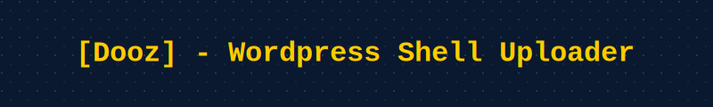
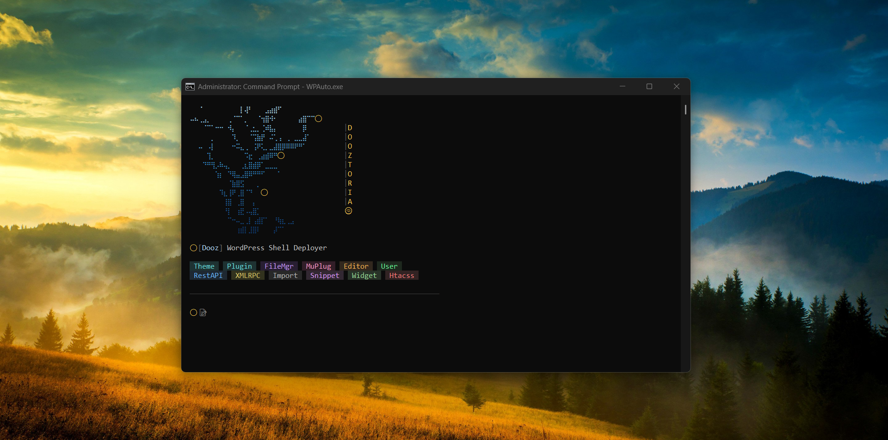
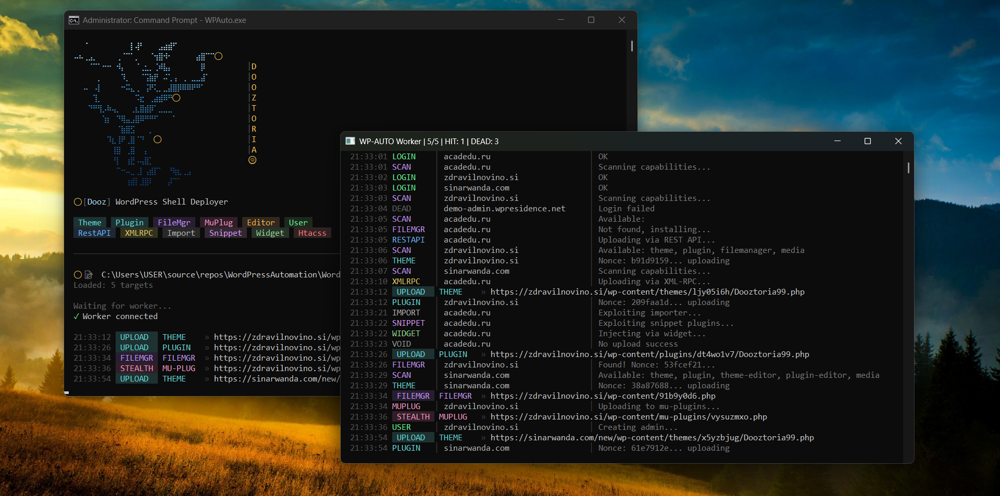
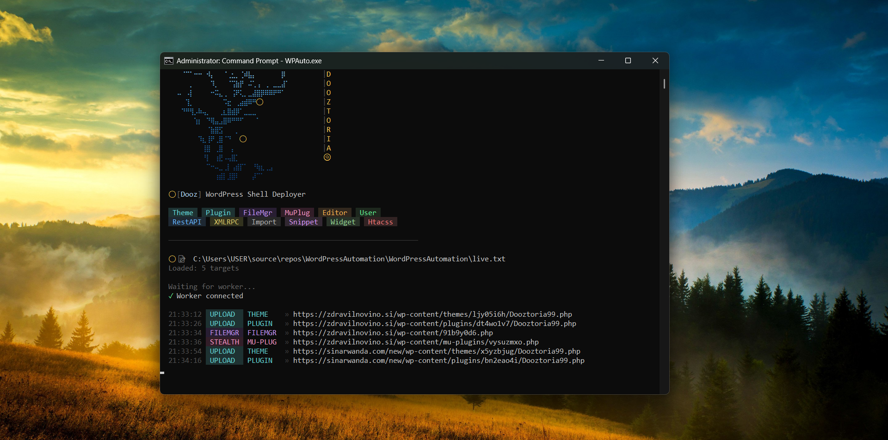
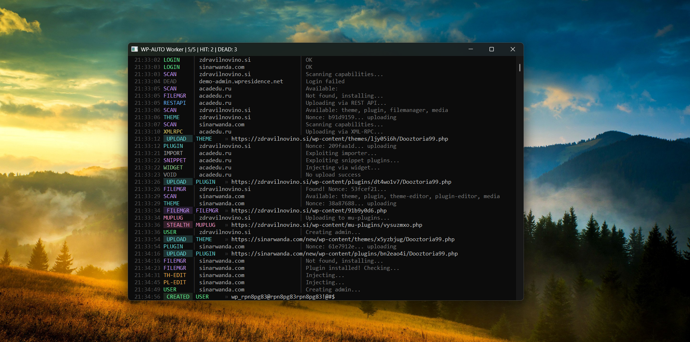
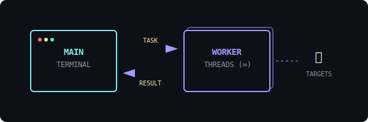

<div align="center">



### Worpress Shell Deployer 

<p align="center">
  
  
  
  
</p>

<p align="center">
  <a href="#-about">About</a> •
  <a href="#-gallery--demo">Gallery</a> •
  <a href="#-key-features">Features</a> •
  <a href="#-capabilities">Capabilities</a> •
  <a href="#-output-structure">Output</a> •
  <a href="#-contact">Contact</a>
</p>

</div>

---

## ♨️ About

**WPAUTO** is a specialized software engineered with a singular objective: gaining access to one of the largest CMS platforms globally—WordPress. This tool automates the process of shell uploading and persistence, bringing you full webshell access through intelligent detection and multiple injection vectors.

> **Disclaimer:** This tool is intended for security research and educational purposes only. The authors are not responsible for any misuse of this software.

---

## 📸 Gallery & Demo

<div align="center">
  <table>
    <tr>
      <td align="center">
        <b>Main Interface</b><br>
        
      </td>
      <td align="center">
        <b>Scanning Process</b><br>
        
      </td>
    </tr>
    <tr>
      <td align="center">
        <b>Shell Injection</b><br>
        
      </td>
      <td align="center">
        <b>Admin Creation</b><br>
        
      </td>
    </tr>
  </table>
</div>

<div align="center">
  <h3>🎥 Watch Demo Preview</h3>
  <video src="Video/Demo.mp4" width="80%" controls></video>
  <p><i>Note: If the video does not load, <a href="Video/Demo.mp4">click here to download</a>.</i></p>
</div>

---

## ⚡ Key Features

| Feature | Description |
| :--- | :--- |
| `[+]` **14+ Upload Methods** | Extensive array of injection vectors maximizing success rates. |
| `[#]` **Security Bypass** | Auto-detection and bypass for **20+ Security Plugins** (Wordfence, Sucuri, etc.). |
| `[*]` **Smart Capability** | Parallel detection scanning to identify the best injection path automatically. |
| `[@]` **Persistence Mode** | Auto-deployment of multiple backup shells and backdoor users. |
| `[$]` **Credential Handler** | Supports **4 Credential Formats** and Auto-Password Change functionality. |
| `[>]` **High Performance** | **Dual Terminal Architecture** with unlimited threading support. |

---

## 🗼 Capabilities & Modules

### 📤 Upload Vectors (14 Total)
WPAUTO employs a diverse range of methods to ensure payload delivery:

* `[THEME UPLOAD]` ZIP Shell Injection
* `[PLUGIN UPLOAD]` ZIP Shell Injection
* `[FILE MANAGER]` Upload / Create / Edit
* `[MU-PLUGINS]` Stealth Auto-Execute
* `[THEME EDITOR]` Obfuscated Code Injection
* `[PLUGIN EDITOR]` Obfuscated Code Injection
* `[MEDIA UPLOAD]` Multi-extension Bypass
* `[REST API]` `/wp-json` Endpoint Bypass
* `[XML-RPC]` Legacy API Bypass
* `[SNIPPET]` WPCode / CodeSnippets Exploitation
* `[HTACCESS]` PHP Handler Manipulation
* `[WIDGET]` Sidebar Injection
* `[IMPORTER]` WXR Exploitation

### 🛡️ Defense Evasion
**Auto-Disable & Bypass** for major security suites:
* Wordfence, Sucuri, iThemes, AIOS
* Cerber, NinjaFirewall, Jetpack
* Defender, Shield, BulletProof, Hide My WP
* *...and more.*

**Obfuscation Engine:**
* **8 Variants** of obfuscated injection code.
* Designed to appear as legitimate WordPress core code.
* Low detection rate against static scanners.

### ♾️ Persistence
Ensure long-term access with:
* **[ADMIN CREATOR]** Automatically spawns a hidden administrator user.
* **[PASSWORD CHANGER]** Rotates credentials for continued access.
* **[BACKUP SHELLS]** Plants multiple access points across the directory.

---

## 💻 System Architecture

WPAUTO utilizes a **Dual Terminal Architecture** to decouple interface rendering from processing logic, ensuring maximum stability during high-volume threading.

<div align="center">
  
</div>

* **Main Terminal:** Handles UI, config parsing, and result aggregation.
* **Worker Terminal:** dedicated process for unlimited multi-threading and connection handling.

* **Configurable:** Full control via `config.ini`.
* **Compatibility:** Multi-device support.

---

## 📁 Output Structure

Results are organized systematically for easy retrieval:

```text
/Output
├── shell.txt                  # Successful shell URLs
├── theme_uploaded.txt         # Via Theme method
├── plugin_uploaded.txt        # Via Plugin method
├── muplugins_uploaded.txt     # Via Must-Use Plugins
├── filemanager_uploaded.txt   # Via File Manager
├── editor_injected.txt        # Via Editor Injection
├── admin_created.txt          # Created Admin Credentials
└── password_changed.txt       # Rotated Credentials

```

---

## 📩 Contact & Support

For access, updates, and inquiries:

<div align="center">

**🍥 Official Channel:** [t.me/Dooztoria](https://www.google.com/search?q=https://t.me/Dooztoria)

</div>

---

<p align="center">DOOZTORIA • WPAUTO © 2025</p>
